# CONFIGURATION - VAL3D

*Documentation de configuration - Jules Pierrat - 08/03/2022 - v1.1.0*

----------
## SOMMAIRE

1. Données Géographiques
2. Points of Interest (POI)
3. BIM
4. Gestion des utilisateurs
5. Gestion des plugins

## AVANT-PROPOS

Dans cette partie nous allons voir les parties suivantes:

Comment ajouter manuellement des __données géographiques__ et les configurer.

Comment ajouter des __Points of Interest (POI)__ et les configurer.

Comment paramétrer un __projet BIM__ pour l’afficher dans VAL3D.

Comment gérer les différents __utilisateurs__ et leurs droits d’accès.

Comment ajouter ou supprimer __des plugins__ et quels utilisateurs y auront accès.


*Note : Aujourd’hui, la configuration se fait manuellement et nécessite quelques connaissances en __json__ et manipulation de base de données. Dans une future version de VAL3D, cette configuration manuelle compliquée sera
remplacée par une interface administrateur qui s’occupera de gérer l’ensemble de ces tâches de manière simplifiée.*

Avant toute chose, assurez vous d'avoir bien suivi [le guide d'installation de Val3D](./INSTALLATION.md)

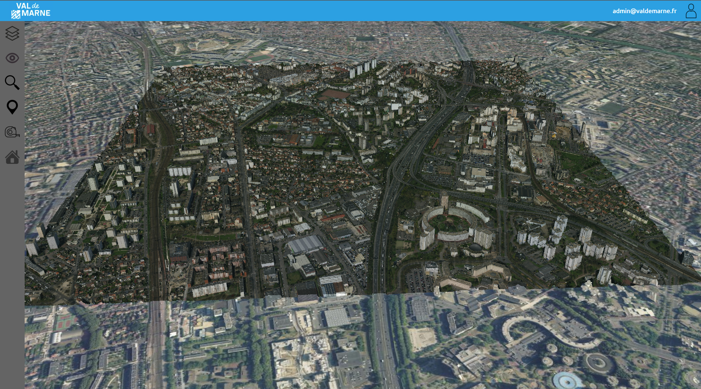

## 1. Données Géographiques

### 1.1 Structure de la table layer
La base de données contient une table __layer__ qui permet de décrire l’ensemble des données géographiques qu’un utilisateur peut visualiser.
Cependant chaque utilisateur n'a pas accès aux même couches de données en fonction de ses paramétrages dont le détail sera abordé plus loin dans ce document

La table s'organise de la façon suivante:
| Attributs | Type      | Définition                                                                                                                                                                                                                                                               |
| --------- | --------- | ------------------------------------------------------------------------------------------------------------------------------------------------------------------------------------------------------------------------------------------------------------------------ |
| ID        | int       | __Identifiant numérique unique de la couche__. <br /> Il permet de trier l’ordre d’affichage des couches dans le menu couche de VAL3D. <br /> *Ex : 1*                                                                                                                   |
| Name      | char      | __Nom de la couche__. <br /> Ce libellé est affiché dans le menu des couches de VAL3D, il permet de faciliter la compréhension de la nature de cette couche par l’utilisateur. <br /> *Ex : Val-de-Marne 3D*                                                                 |
| Path      | char      | __Chemin d’accès à la donnée__. <br /> Permet de définir où VAL3D récupère les données de la couche (adresse http, localisation sur le réseau, …). <br /> *Ex : data/Photomaillage/tileset.json*                                                                             |
| Type      | char      | __Type de la donnée__. <br /> Mot clef qui permet de définir la nature des objets pour VAL3D. Ce mot clef fait parti d’une liste définie, décrite dans la suite de ce document. <br /> *Ex : 3dtiles*                     |
| Display   | boolean   | __Boolean d’affichage par défaut__. <br /> Défini si la couche est visible par défaut dans le viewer VAL3D. <br /> *Valeurs : true, false*                                                                                                                              |
| Groupe    | char      | __Nom du groupe auquel appartient la couche__. <br /> Ce nom de groupe permet de trier les couches par groupe. Si deux couches appartiennent au même groupe, il faut alors utiliser la même dénomination. <br /> *Ex : Plan*                            |
| Meta      | json      | __Métadonnées pour configurer le style de la couche__. <br /> Elles sont renseignées au format json et spécifiques à chaque type de couche. Cet attribut est détaillé dans la suite de cette section pour chaque type de donnée.  <br />*Ex : {‘’WMS‘’ :{},’’style’’ :{}}* |
| Access    | list char | __Liste des groupes d'utilisateurs autorisées à accéder à la donnée__. <br /> Renseignés en majuscule et séparés un point virgule <br /> *Ex: ADVANCED;ADMIN;*                                                                                                         |

### 1.2 Photomaillage / 3dtiles :
VAL3D permet d’ ajouter et configurer un photomaillage 3D du territoire. Un photomaillage est un fichier au format 3dtiles. Cela signifie qu’il est structuré comme suit :

1. Un répertoire `Data` contenant un ensemble des tuiles pyramidales au format .b3dm
2. Un fichier `tileset.json` qui organise ces tuiles les unes par rapports aux autres.

Ce fichier 3dtiles peut être stocké dans le répertoire `./data` comme vu dans [le guide installation](./INSTALLATION.md) mais également
sur un serveur extérieur.
Pour ajouter un photomaillage dans VAL3D, il suffit de remplir les champs de la table layer comme vu précédemment.

Le __path__ à renseigner est le chemin d'accès au fichier `tileset.json`.

Le __type__ à renseigner est __3dtiles__. 

Il est inutile de renseigner l’attribut Meta car le photomaillage n’est pas paramétrable.

Voici un exemple de photomaillage stocké sur le serveur web dans un répertoire Photomaillage/VM3D :
| ID  | Name            | Path                                 | Type    | Display | Groupe    | Meta | Access |
| --- | --------------- | ------------------------------------ | ------- | ------- | --------- | ---- | ------ |
| 1   | Val-de-Marne 3D | data/Photomaillage/VM3D/tileset.json | 3dtiles | true    | Cartes 3D |      | ALL;   |

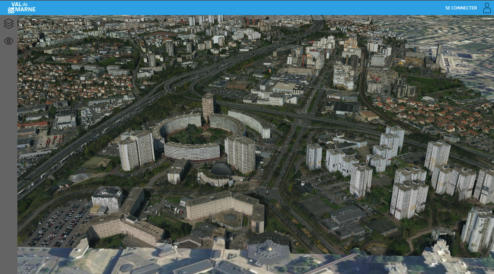


### 1.3 Couche vectorielle 2D surfacique
VAL3D permet d'ajouter et configurer une couche vectorielle 2D surfacique.
Ce fichier doit obligatoirement être au format Geojson surfaces et les attributs de cette couche doivent être nommés comme ils apparaîtront dans VAL3D.

Ce fichier Geojson doit être stocké sur le serveur web ou sur un serveur distant.

Pour pouvoir ajouter un fichier de données Geojson dans VAL3D, il suffit de remplir les champs de la table __layer__ comme vu
précédemment.

Le __type__ à renseigner est __vectS__. 
L’attribut __Meta__ est au format __json__ et il permet dans ce cas de paramétrer le style par défaut de la couche.

Dans cette version de VAL3D, seules __la couleur par défaut__ et __l’opacité par défaut__ sont paramétrables.

Voici un exemple de Geojson stocké sur le serveur web dans un répertoire Administratif et avec un style par défaut définit comme couleur verte et opacité 50% :

| ID  | Name   | Path                              | Type  | Display | Groupe        | Meta              | Access |
| --- | ------ | --------------------------------- | ----- | ------- | ------------- | ----------------- | ------ |
| 2   | Forêts | data/Environnement/forets.geojson | vectS | true    | Environnement | *comme ci-dessous | ALL;   |

__PARAMETRAGE META:__

```json
{
    "style": {
        "type": "uniq",
        "fill_color": {
            "red": 0,
            "green": 255,
            "blue": 0,
            "alpha": 0.5
        }
    }
}
```
Ce qui donne: 

{
    "style": {
        "type": "uniq",
        "fill_color": {
            "red": 0,
            "green": 255,
            "blue": 0,
            "alpha": 0.5
        }
    }
}

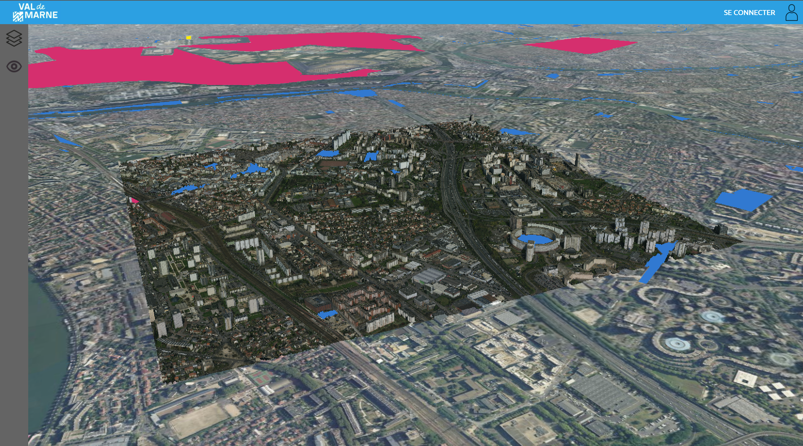

*Sur cette illustration, les différentes surfaces sont stylisées en fonction de leurs attributs.*

### 1.4 Couche vectorielle 2D contours
Val3D permet d'ajouter et configurer une couche vectorielle 2D surfacique pour afficher ces contours.
Ce fichier doit obligatoirement être au format Geojson surfaces et les attributs de cette couche doivent être nommé comme ils apparaîtront dans VAL3D.

Ce fichier Geojson doit être stocké sur le serveur web ou sur un serveur distant.

Pour pouvoir ajouter un fichier de données Geojson dans VAL3D, il suffit de remplir les champs de la table __layer__ comme vu
précédemment.

Le __type__ à renseigner est __vectC__.
L’attribut __Meta__ est au format __json__ et il permet dans ce cas de paramétrer le style par défaut de la couche. Dans cette version de VAL3D, seules la couleur par défaut, l’opacité par défaut et l’épaisseur par défaut sont paramétrables.

Voici un exemple de Geojson stocké sur le serveur web dans un répertoire Environnement et avec un style par défaut définit comme couleur magenta, opacité 80% et une épaisseur de 2 pixels :

| ID  | Name                | Path                                        | Type   | Display | Groupe        | Meta              | Access |
| --- | ------------------- | ------------------------------------------- | ------ | ------- | ------------- | ----------------- | ------ |
| 3   | Limite des communes | data/Administratif/limites_communes.geojson | vectC | true    | Administratif | *comme ci-dessous | ALL;   |


__PARAMETRAGE META:__
```json
{
    "style": {
        "type": "uniq",
        "stroke_color": {
            "red": 255,
            "green": 0,
            "blue":255,
            "alpha": 0.8
        },
        "stroke_width": 2
    }
}
```

Ce qui nous donne:

{
    "style": {
        "type": "uniq",
        "stroke_color": {
            "red": 255,
            "green": 0,
            "blue":255,
            "alpha": 0.2
        },
        "stroke_width": 2
    }
}

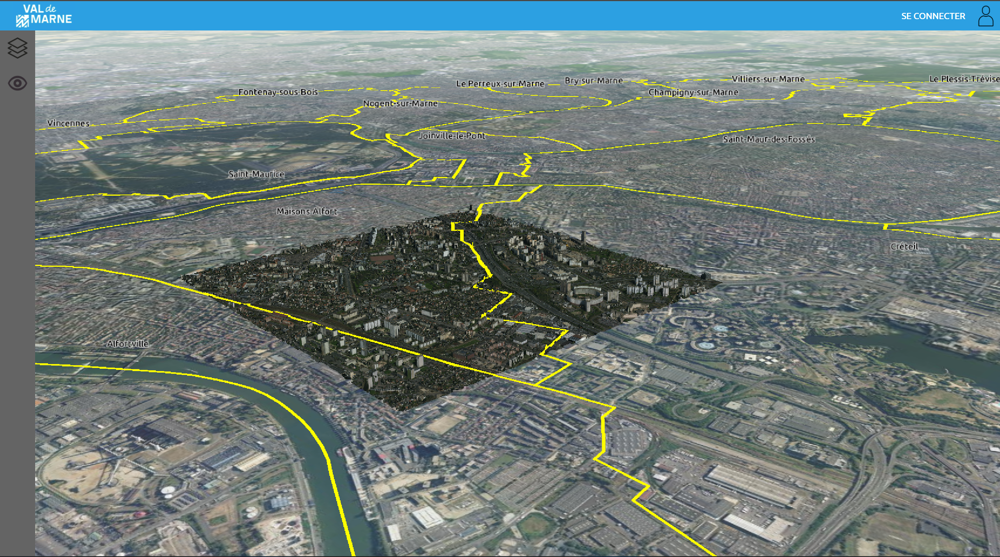

*Ici la couche est représentée avec une etiquette du nom de commune*

*Note : Il est important de noter que les couches vectorielles surfaces et les couches vectorielles contours sont toutes les deux construites sur la base de fichier Geojson contenant des surfaces. Césium par défaut ne permet pas d’affecter un remplissage et un contour à une surface ce qui explique la séparation entre les deux actuellement. Il sera très utile de fusionner les deux dans une future version de VAL3D afin de simplifier la gestion des couches.*

*/ ! \ Attention pour le développement futur, Cesium additionne les couleurs lorsque des couches de différentes couleurs se superposent. A prendre en compte.*

### 1.5 Couche vectorielle 2D Polylignes :

Dans cette partie nous verrons comment ajouter et configurer une couche vectorielle 2D de polylignes (Type: LineString et non MultipleLineString).
Ce fichier doit forcément être au format Geojson linéaire et les attributs de cette couche doivent être nommé comme ils apparaîtront dans VAL3D.

Ce fichier Geojson doit être stocké sur le serveur web ou sur un serveur distant.

Pour ajouter ce Geojson dans VAL3D, il suffit de remplir les champs de la table __layer__ comme vu
précédemment.

Le __type__ à renseigner est __vectL__.
L’attribut __Meta__ est au format __JSON__ et il permet dans ce cas de paramétrer le style par défaut de la couche. Dans cette version de VAL3D, seule la couleur par défaut, l’opacité par défaut et l’épaisseur par défaut sont réglable. Dans une future version, Il serait intéressant de pouvoir donner un style attributaire par défaut ou même une étiquette.

Voici un exemple de Geojson stocké sur le serveur web dans un répertoire Routes et avec un style par défaut définit comme couleur orange, opacité 100% et une épaisseur de 3 pixels :

| ID  | Name                | Path                                        | Type   | Display | Groupe        | Meta              | Access |
| --- | ------------------- | ------------------------------------------- | ------ | ------- | ------------- | ----------------- | ------ |
| 4   | Départementales | data/Routes/departementales.geojson | vectL | true    | Routes | *comme ci-dessous | ALL;   |


__PARAMETRAGE META:__
```json
{
    "style": {
        "type": "uniq",
        "stroke_color": {
            "red": 255,
            "green": 180,
            "blue":0,
            "alpha": 1
        },
        "stroke_width": 3
    }
}
```

Ce qui nous donne:

{
    "style": {
        "type": "uniq",
        "stroke_color": {
            "red": 255,
            "green": 180,
            "blue":0,
            "alpha": 1
        },
        "stroke_width": 3
    }
}

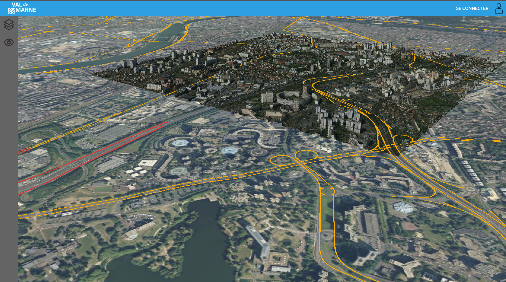

***Remarque : dans une future version de VAL3D une amélioration envisagée du champ META est d’attribuer le style grâce à un attribut, oire d’affecter des étiquettes.***

### 1.6 Couche vectorielle 2.5D Volume :

VAL3D permet d'ajouter et configurer une couche vectorielle 2.5D surfacique pour afficher un volume extrudé.
Ce fichier doit obligatoirement être au format Geojson surfaces et les attributs de cette couche doivent être nommé comme ils apparaîtront dans VAL3D.

Ce fichier Geojson doit être stocké sur le serveur web ou sur un serveur distant.

Pour ajouter ce fichier de données Geojson dans VAL3D, il suffit de remplir les champs de la table __layer__ comme vu précédemment.

Le __type__ à renseigner est __vectV__.
L’attribut __Meta__ est au format __JSON__ et il permet dans ce cas de paramétrer le style par défaut de la couche.

Cette couches ce stylise comme les couches vectS et vectC, les contours et le remplissage peuvent être modifié. Vous pouvez également renseigner l'attribut `height_field` qui choisira quel attribut de la couche correspond à la valeur à extrudé (défaut: `HAUTEUR`).

Voici un exemple de fichier de données Geojson stocké sur le serveur web dans un répertoire Statistiques.

| ID  | Name                | Path                                        | Type   | Display | Groupe        | Meta              | Access |
| --- | ------------------- | ------------------------------------------- | ------ | ------- | ------------- | ----------------- | ------ |
| 10   | Communes | data/Statistiques/communes.geojson | vectV | true    | Statistiques | *comme ci-dessous | ALL;   |

__PARAMETRAGE META:__
```json
{
    "style": {
        "height_field": "POPULATION_BDTOPO2017",
        "type": "uniq",
        "stroke_color": {
            "red": 255,
            "green": 255,
            "blue":0,
            "alpha": 1
        },
        "stroke_width": 3,
        "fill_color": {
            "red": 255,
            "green": 0,
            "blue": 255,
            "alpha": 1
        }
    }
}
```

Ce qui nous donne:

{
    "style": {
        "height_field": "POPULATION_BDTOPO2017",
        "type": "uniq",
        "stroke_color": {
            "red": 255,
            "green": 255,
            "blue":0,
            "alpha": 1
        },
        "stroke_width": 3,
        "fill_color": {
            "red": 255,
            "green": 0,
            "blue": 255,
            "alpha": 1
        }
    }
}

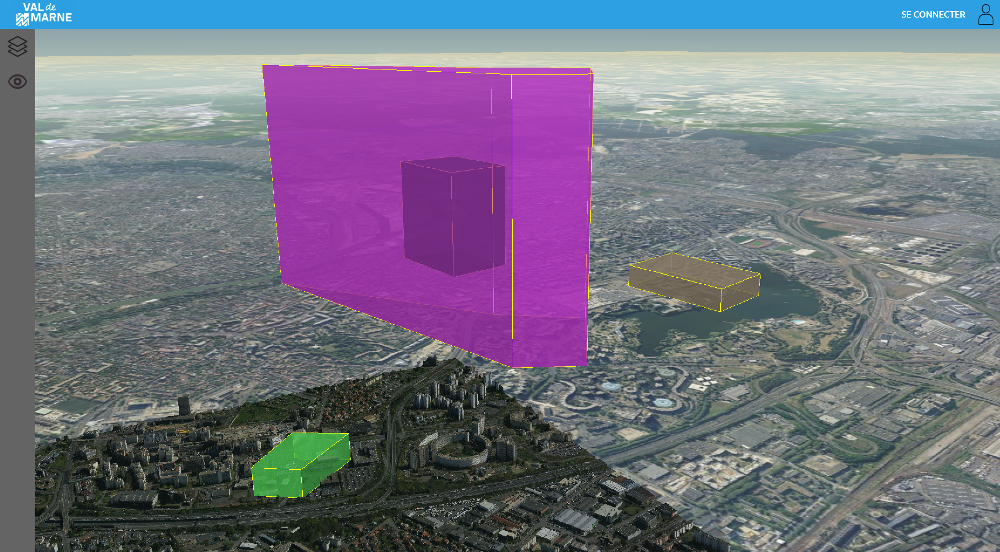

### 1.7 OpenStreetMap Imagery

Cesium MAJ WMS

### 1.8 Geovaldemarne WMS

CESIUM MAJ WMS

### 1.9 Géoservice IGN WMTS :

VAL3D permet d'ajouter des flux WMTS du Géoportail IGN au viewer Cesium.
Pour ajouter ce flux WMTS à VAL3D, il est nécessaire de paramétrer correctement les attributs Path, Type et Meta dans la table layer.

L'ensemble des informations nécessaire à la configuration d'une couche Geoservice IGN dans VAL3D sont disponibles [ici](https://geoservices.ign.fr/services-web-experts)

L'attribut __Path__ permet de renseigner l'URL WMTS sans arguments de la couche geoservice IGN.

L'attribut __Type__ doit être renseigné comme __imageryGP__.

Voici un exemple de comment ajouter une couche WMTS Plan Parcellaire du Géoportail avec une opacité de
80% par défaut :

Aller sur [le site géoservice décrivant cette donnée](https://geoservices.ign.fr/services-web-experts-parcellaire) (https://geoservices.ign.fr/services-web-experts-parcellaire).

On récupère alors les différentes infos nécessaire:
1. Url d'accès aux données: https://wxs.ign.fr/parcellaire/geoportail/wmts?SERVICE=WMTS&VERSION=1.0.0&REQUEST=GetCapabilities
2. Données: CADASTRALPARCELS.PARCELLAIRE_EXPRESS
3. Format: images/png

On peut alors remplir la base de données comme suit:

| ID  | Name                | Path                                        | Type   | Display | Groupe        | Meta              | Access |
| --- | ------------------- | ------------------------------------------- | ------ | ------- | ------------- | ----------------- | ------ |
| 5  | Parcellaire | https://wxs.ign.fr/parcellaire/geoportail/wmts | imageryGP | true | IGN | *comme ci-dessous | ALL; |

PARAMETRAGE META :

```json
{
    "WMTS": {
        "layer": "CADASTRALPARCELS.PARCELLAIRE_EXPRESS",
        "format":"image/png",
    },
    style: {
        "opacity": 0.8
    }
}
```

Ce qui donne :
{
    "WMTS": {
        "layer": "CADASTRALPARCELS.PARCELLAIRE_EXPRESS",
        "format":"image/png",
    },
    style: {
        "opacity": 0.8
    }
}

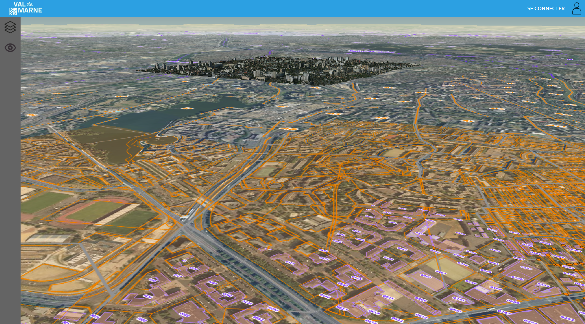

*Parcellaire IGN sur OrthoImage IGN*


### 1.10 OSM Building
Pour ajouter OSM Building à VAL3D, il suffit d’ajouter un enregistrement dans la table layer et renseigner l’attribut __Type__ avec le mot-clef __buildingOSM__.

Cette couche n’est pas paramétrable.

Exemple :
| ID  | Name                | Path                                        | Type   | Display | Groupe        | Meta              | Access |
| --- | ------------------- | ------------------------------------------- | ------ | ------- | ------------- | ----------------- | ------ |
| 6 | Buildings |  | buildingsOSM | true | OSM |  | ALL; |

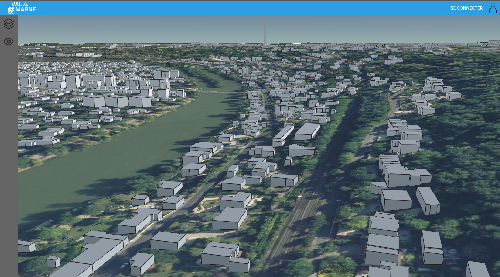

### 1.11 Skybox
La couche skybox sert d'image de fond derrière le globe Cesium qui sert de support aux photomaillages et couches de données. Il suffit de fournir le path d’une image au format jpg/png carré et cohérente bord à bord. Une future version de VAL3D pourrait permettre de choisir 6 images différentes et
de proposer un rendu plus intéressant.

L'attribut __Path__ doit être renseigné avec le mot-clef __skybox__.

Exemple :


Exemple :
| ID  | Name                | Path                                        | Type   | Display | Groupe        | Meta              | Access |
| --- | ------------------- | ------------------------------------------- | ------ | ------- | ------------- | ----------------- | ------ |
| 7 | Ciel Bleu | data/skybox/blue_sky.jpg | skybox | true | Skybox |  | NONE; |

## 2. Point of Interest (POI) :

Les points d'intérêt ou POI servent à afficher une donnée géographique ponctuelle grâce à une icône. L’administrateur de VAL3D peut personnaliser l’apparence, la position ou même la fiche de description des objets. Le principe est que lorsque l'utilisateur clique sur une icône géoréférencée dans VAL3D, une fenêtre modale s'ouvre au sein dans laquelle on peut afficher une page Web.

Un POI est un ensemble de trois fichiers figurant au sein d’un même répertoire comme ci-dessous :
* Un fichier __data.json__ au format geojson ponctuel et qui décrit la géométrie et les attributs des POI.
* Un fichier __preset.html__ qui décrit la page web à afficher dans la fenêtre modale. Elle décrit à la fois le style et la structure de la page. On peut y insérer des références aux attributs du fichier data.json.
* Un fichier __dico.json__ qui permet de faire le lien entre les attributs du fichier geojson et certains textes du fichier html.

<p align="center">
    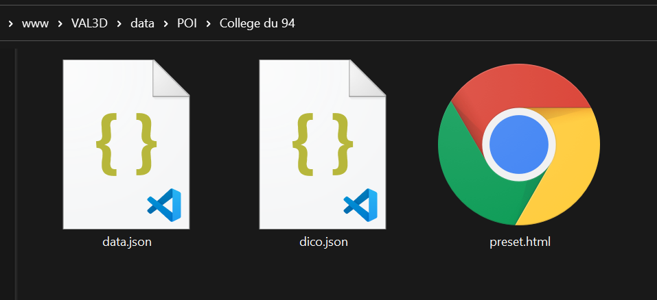
</p>

### 2.1 Description de la table poi 

La table __poi__ de la base de donnée permet de décrire l’ensemble des Point Of Interest (POI) qu’un utilisateur peut visualiser.
Cependant chaque utilisateur n'a pas accès aux même couches de données en fonction de ses privilèges.

Cette table s'organise de la façon suivante :

| Attribut | Type | Définition |
| -------- | ---- | ---------- |
| id | int | __Identifiant numérique unique de la couche de POI__ <br /> Il permet de trier l’ordre d’affichage des POI dans le menu POI de VAL3D <br /> *Ex : 1* |
| Nom | char | __Nom de la couche POI__ <br /> Ce nom est affiché dans le menu des POI de VAL3D, il permet de faciliter la compréhension du contenu de cette couche par l’utilisateur. <br /> *Ex : Collèges du 94* |
| Path | char | __Chemin d’accès à la donnée__ <br /> Permet de définir où VAL3D récupère les données des POIs. Cela correspond au répertoire parents des trois fichiers décrits précédemment. <br /> *Ex : data/POI/RepDataPoi (Pour le cas ci-dessus)* |
| Meta | json | __Métadonnées pour configurer le style des POIs__. <br /> Elles sont renseignées au format __json__ et permettent de gérer l’icône de chaque POI et son emplacement par rapport au terrain.
| Access | list char | __Liste des groupes d'utilisateurs autorisées à accéder à la donnée__. <br /> Renseignés en majuscule et séparés d'un point virgule <br /> *Ex: ADVANCED;ADMIN;* |

### 2.2 Descriptions des paramètres d'un POI

#### 2.2.1 Le fichier data.json

Le fichier __data.json__ respecte les normes GeoJSON de données ponctuelles. Il peut posséder autant d'attribut que souhaitée.

#### 2.2.2 Le fichier preset.html

__preset.html__ est le fichier qui décrit la structure, le style et le comportement de la fenêtre modale associée au POI considéré. Il respecte les normes html5 et peut contenir des attributs de style et des scripts javaScript.

#### 2.2.3 Le fichier dico.json

__dico.json__ est le fichier permettant de lier les deux fichiers précédents. VAL3D lit le contenu de ce fichier et remplace l'ensemble des clefs du fichier présentes dans __preset.html__ par l'attribut coorespondant à la valeur de cette clef dans le fichier __data.json__.

data.json :
```json
{
    "CLEF-1": "VALEUR_1",
    "CLEF-2": "VALEUR_2",
    "CLEF-3": "VALEUR_3"
}
```

Exemple : Supposons qu’un fichier geojson ponctuel possède des attributs __Nom__ et __Image__ et que la page __preset.html__
possède les  éléments suivants:

```html
<p>[NOM DE L'ETABLSSEMENT]</p>

```

On peut alors déclarer le fichier __dico.json__ de la sorte:
 ```json
{
    "[NOM DE L'ETABLISSEMENT]": "Nom",
    "[PATH_IMAGE]": "Image"
}
 ```

 Après analyse VAL3D crée alors une fenêtre modale avec la structure suivante:

```html
<p>Collège Albert Einstein</p>

```

 ### 2.3 Ajout de POI dans VAL3D

Pour pouvoir ajouter, une couche POI à VAL3D il faut ajouter une ligne à la table __poi__.

Exemple:
On souhaite ajouter la liste des collèges du Val-de-Marne à VAL3D. Les fichiers __data.json__, __preset.html__ et __dico.json__ ont déjà été configurés et sont situé dans un répertoire `./data/POI/College94`.

On remplira la table de cette manière :

| id | Nom | Path | Meta | Access |
| -- | --- | ---- | ---- | ------ |
| 1 | Colleges du 94 | data/POI/College94 | *comme si dessous | ADMIN; |

__PARAMETRAGE META:__

```json
{
    "style": {
        "image":"https://img.icons8.com/officel/2x/school.png",
        "image_scale":0.15
    },
    "height":150
}

// AUTRE EXEMPLE

{
    "style": {
        "image_field":"ICON_PATH", //Atribut ICON_PATH dans le geojson
        "image_scale":0.15
    },
    "height_relativ":10
}
```
* La clef __image__ définit l'image qui sera utilisé pour illustré le POI sur VAL3D. Dans cet exemple, tous les collèges seront représenté par la même icône. On peut remplacer __image__ par __image_field__ pour renseigner un attribut de la couche data.json et ainsi personnaliser chaque image.

* La clef __image_scale__ définit la taille de l'image affiché sur VAL3D

* La clef __height__ définit la hauteur ellispoïdale du POI. Pour avoir une hauteur variante selon le POI, il faut utiliser la clef __height_field__. Pour avoir une hauteur relative au MNT, il faut utiliser la clef __height_relativ__.


Une fois l’ensemble des attributs de la table renseignés, la couche de POI apparaît dans le menu POI.

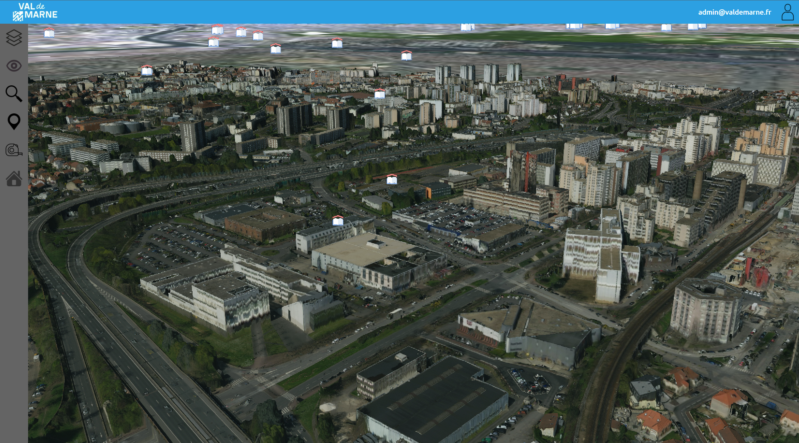
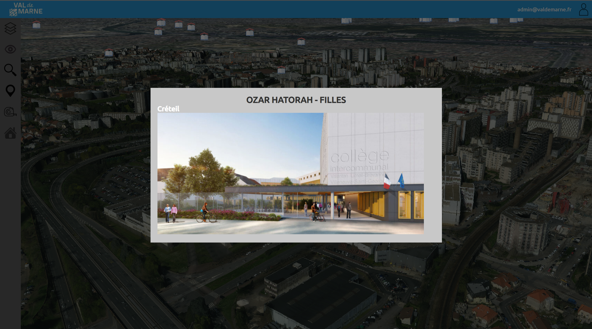


## 3. Projet BIM

VAL3D permet d’importer au sein de son monde 3D des maquettes BIM. Le fichier de partage du BIM est l’IFC (.ifc) mais pour des raisons d’optimisation, il est plus intéressant d’utiliser le format glTF. Le poids du fichier ne devra pas être trop lourd pour permettre son affichage sans ralentir VAL3D.

VAL3D est fourni avec des logiciels opensources permettant de réaliser cette conversion. Cependant, elle doit être faite manuellement.

Il existe cependant un script `./server/convertIfc.sh` qui peut être utilisé afin de facilité la conversion. Pour installer ce script, il faut d'abord l'installer avec le script `./server/installIfcConverter.sh`

```bash
# Installation des composants de conversion
./server/installIfcConverter.sh

# Conversion d'un fichier IFC
./server/convertIfc.sh

```

*Note: Dans le répertoire `./server/` il existe deux outils open-sources permettant de passer de __.ifc__ à __.glTF__. IfcConverter permet de passer de __.ifc__ à __.dae__ ([Documentation](http://ifcopenshell.org/ifcconvert), http://ifcopenshell.org/ifcconvert) et ColladaToGltf permet de passer de __.dae__ à __.glTF__. ([Documentation](https://github.com/KhronosGroup/COLLADA2GLTF), https://github.com/KhronosGroup/COLLADA2GLTF)*

Une fois la maquette BIM convertie en glTF et renommé `maquette.gltf`, il faut la placer dans son propre répertoire accompagnée d'un fichier `meta.json` et une image carrée `img.jpg`, qui sert d’illustration du projet dans la menu BIM.

Ce fichier permet de géoréférencer la maquette BIM. Il doit être rempli manuellement car il n’existe pas de plugin et d’interface graphique pour générer ce fichier dans la version actuelle de VAL3D.

Le fichier meta.json est configuré comme ci-dessous :
* __longitude__ : Longitude (°) en WGS84 (coordonnée de l’origine de la maquette).
* __latitude__ : Latitude (°) en WGS84 (coordonnée de l’origine de la maquette).
* __height__ : Hauteur ellipsoïdale (AIG GRS80).
* __scale__ : Echelle (Généralement 1)
* __rotation__ : Angle (°) de rotation entre l’axe x de la maquette et l’axe tangent à l’ellipsoïde dirigé vers le nord.
* __envelop__: Enveloppe de la maquette BIM. C'est une array de coordonnées WGS84. Il faut noter que les premières et dernières coordonnées sont identiques.

L’image `img.jpg` doit être carrée et placée dans le même répertoire que les fichiers précédents.


Pour ajouter la maquette dans VAL3D, il faut remplir la table __bim__ de la base de données. Elle est structurée de cette façon :

| Attribut | Type | Description |
| -------- | ---- | ----------- |
| Id | Int | __Identifiant numérique unique des projets BIM__. <br /> Il permet de trier l’ordre d’affichage des projets BIM dans le menu BIM. <br />*Ex : 1* |
| Name | char | __Nom du projet BIM__ <br /> Ce nom est affiché dans le menu des projets BIM de VAL3D, il permet de faciliter la compréhension du contenu du projet par l’utilisateur. <br /> *Ex : Bâtiment Eiffel*
| Description | char | __Description du projet BIM__. <br /> Cette description est libre, elle permet de donner plus de détails à l’utilisateur sur la nature du projet (adresse, architecte, prix, etc.) <br /> *Ex :*<br />*Adresse : X rue Xxxxxxx 94000 Creteil* <br/> *Architecte : ------* |
| Path | char | __Chemin d’accès à la donnée__. <br /> Permet de définir où VAL3D récupère les projets BIM. Cela correspond au répertoire parent des trois fichiers décrits précédemment. <br />*Ex : data/Projet_BIM/gymnase-marc-valentin* |
| Access | list char | __Liste des groupes d'utilisateurs autorisées à accéder à la donnée__. <br /> Renseignés en majuscule et séparés d'un point virgule <br /> *Ex: ADVANCED;ADMIN;* |


Une fois l’ensemble de ces champs complétés, le projet BIM est disponible dans le menu projet BIM de VAL3D.


## 4.Gestion des utilisateurs :

L’administrateur de VAL3D a la possibilité de créer plusieurs profils utilisateurs dans VAL3D. Cela lui permet
de donner accès ou non à certains plugins, couches, poi ou projets BIM.

La gestion des profils utilisateurs se fait dans la table __user__ de la base de donnée. Elle est structurée comme ci-dessous :

| Attributs | Type | Définition |
| --------- | ---- | ---------- |
| ID | int | __Identifiant numérique unique à chaque utilisateur__. <br /> Il permet d’organiser les utilisateurs pour leur gestion. <br /> *Ex : 1* |
| email | char | __Email de l’utilisateur__. <br /> L’utilisateur se connecte à Val3D grâce à cet identifiant. Pour le moment, il peut être factice. <br /> *Ex : admin@valdemarne.fr* |
| password | char | __Mot de passe de l’utilisateur__. <br />L’utilisateur se connecte à son profil grâce à ce mot de passe. C'est en réalité le hashage par deux fois du mot de passe que doit renseigner l'utilisateur (voir plus loin). <br /> *Ex: val3d* |
| class | char | __Groupe de l’utilisateur__. <br /> Les utilisateurs sont regroupés par groupes afin de gérer plus facilement leurs accès. Le mot BASIC est réservé pour l’utilisateur de base qui n’a pas de compte. Le mot NONE; est utilisé pour masquer une couche des menus VAL3D mais en laissant apparaître dans le viewer. <br /> *Ex : BIM_MANAGEUR* |


Pour se connecter, VAL3D possède en haut à droite de l’interface un bouton __SE CONNECTER__. En remplissant le formulaire avec les données nécessaires, la page est
rechargée avec les plugins correspondant aux droits de l’utilisateur.

Pour connaître le hashage du mot de passe à renseigner dans la base de donnée (par exemple __val3d__), il suffit de ce rendre à cette adresse:

[http://localhost/generateHashedPassword.php?psw=val3d](http://localhost/generateHashedPassword.php?psw=val3d)

## 5. Gestion des plugins:

VAL3D est organisé autour de plugins qui sont modulables dans l'interface. La gestion de ces plugins se fait également depuis la base de données VAL3D grâce à la table plugin structurée comme ci-dessous :

| Attribut | Type | Définition |
| -------- | ---- | ---------- |
| Id | int | __Identifiant numérique unique à chaque plugin__. <br /> Il permet d’organiser l’ordre dans lequel les plugins apparaissent dans le menu de gauche. <br /> *Ex : 1* |
| Name | char | __Nom du plugin__. <br /> C’est le nom qui apparaît en haut du menu (Menu + …) <br /> *Ex : Mesures* |
| Access | list char | __Liste des groupes d’utilisateurs ayant accès au plugin__ <br /> Défini quel(s) groupe(s) ont accès au plugin Chaque groupe est séparé par un point-virgule. | *Ex: BASIC;BIM_MANAGER;ADMIN;* <br /> |
| Path | char | __Chemin d’accès au script JS__ <br /> Permet de définir où VAL3D récupère le script du plugin. Cela correspond à l’adresse du script js (généralement dans le répertoire scripts) <br /> *Ex : scripts/mesures.js* |

*Note : Un script « template.js » est disponible dans le répertoire script. Il correspond à la structure de base
d’un script pour l’intégrer. Il nécessite cependant des connaissance JS et de la librairie CesiumJs pour le compléter.*
