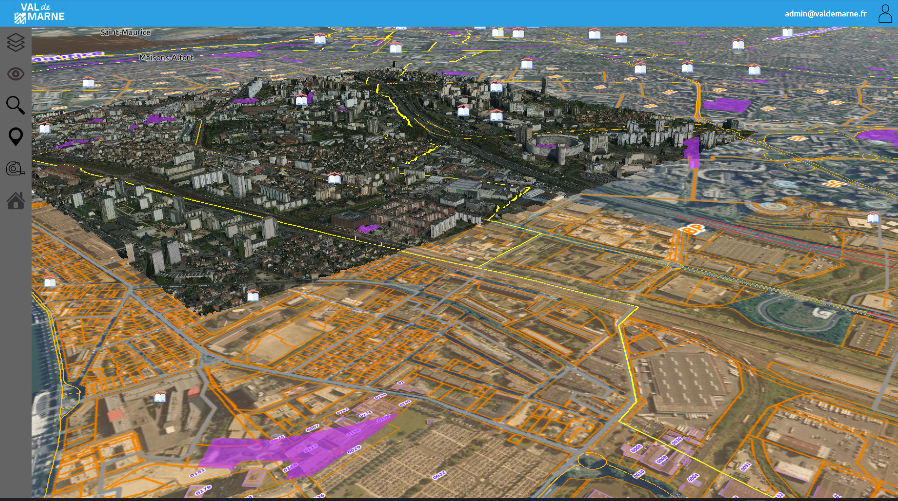

# VAL3D - Visualisateur web de données géographiques 2D et 3D à l'échelle de collectivité

*Présentation générale - Jules Pierrat - 08/03/2022 - v1.1.0*

-----------------------------------------------

## Sommaire
[1. Présentation](#Présentation)

## Présentation

VAL3D est un projet Open Source de viewer 3D Web permettant la consultation de données géographiques 3D et 2D à l’échelle d’un département ou d’une région.

Il est aujourd’hui disponible sur [GitHub](https://Github.com/JulesPierrat/VAL3D).

VAL3D s’installe sur un serveur Web Apache et se configure via une base de données MySQL. Il permet de visualiser des données géographiques 2D vecteur et raster (geojson, geoTiff, WMS, WMTS), 2.5D (OSMBuilding) et 3D (terrain, photomaillage, BIM, glTF, …).

Les différentes étapes d’installation, de configuration et d’utilisation seront détaillées dans la suite de ce document.

## Guides

Voici la liste des documentations utiles :

[Guide d'installation](./INSTALLATION.md)

[Guide de configuration](./CONFIGURATION.md)

[Guide d'utilisation](./UTILISATION.md)

## Crédits
__Développement: Jules Pierrat__

[GitHub](https://github.com/JulesPierrat/VAL3D) | [LinkedIn](https://www.linkedin.com/in/jules-pierrat-107522197/)

__Maintenance, Commanditaire: Conseil Départemental du Val de Marne - Jean-Michel DZIUBICH__ :

[GitHub](https://github.com/sigec94/VAL3D)

